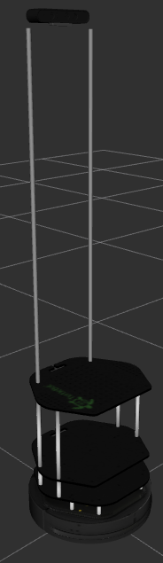

# turtlebot_custom_description
ROS Catkin package to use different URDF configurations for the Turtlebot 2

## Installation
1. Make your catkin workspace:
    1. `mkdir -p ~/catkin_ws/src`
    2. `catkin_init_workspace ~/catkin_ws/src`
    3. `catkin_make -C ~/catkin_ws`
2. Clone this repo to your workspace:
    1. `git clone https://github.com/Dabit-Industries/turtlebot_custom_description ~/catkin_ws/src`
3. Source your workspace
    1. `source ~/catkin_ws/devel/setup.sh`

## Viewing the Robot Model
1. Run ROS core:
    1. `roscore`
2. Launch the robot model
    1. `source ~/catkin_ws/devel/setup.sh`
    2. `roslaunch turtlebot_custom_description robot_model_.8m_tall.launch`
3. Launch rviz
    1. `source ~/catkin_ws/devel/setup.sh`
    2. `rosrun rviz rviz`
4. Configure RVIZ
  
  
  

## Robot Models
1. Turtlebot2 Kobuki Astra:  
  
2. Turtlebot 1.2m tall:  
  
3. Turtlebot Quanergy M8:  
  
